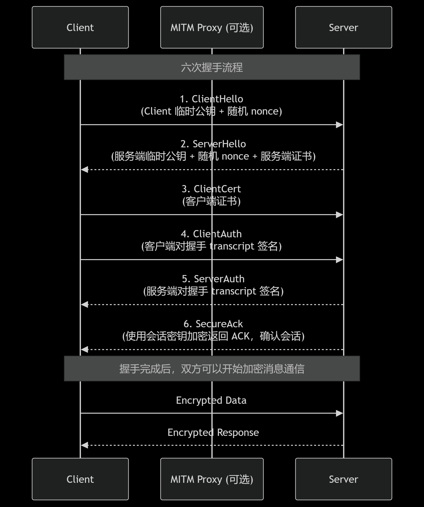

# 天启御链 / Sovereign-Chain

**Sovereign-Chain**（中文名：天启御链）是一套**6次握手端到端加密通信系统**，基于 TCP 实现，支持六次握手、证书认证和 AEAD 加密。  
本项目适合教育、研究和高安全需求场景演示。

---

## 特性

- 🔐 **端到端加密（E2EE）**
  - 使用 X25519 进行临时密钥交换
  - 使用 Ed25519 静态密钥进行身份签名
  - 使用 ChaCha20-Poly1305 进行 AEAD 加密
- ✨ **六次握手**
  1. `ClientHello`：客户端发送临时公钥 + 随机 nonce
  2. `ServerHello`：服务端发送临时公钥 + 随机 nonce + 服务端证书
  3. `ClientCert`：客户端发送证书
  4. `ClientAuth`：客户端对握手 transcript 签名
  5. `ServerAuth`：服务端对握手 transcript 签名
  6. `SecureAck`：服务端用派生会话密钥加密返回 ACK，确认会话
- 🛡️ **证书管理**
  - 自建 CA（根 CA）
  - 服务端 / 客户端证书签发
  - 握手中双方证书验证与签名验证
- ⚡ **高安全性**
  - HKDF-SHA256 派生会话密钥
  - 独立的客户端-服务端、服务端-客户端对称密钥
  - 防重放和防篡改设计

---

## 文件结构

```

.
├── ca.py            # 证书签发端 (生成 CA、server、client 证书)
├── server.py        # 服务端
├── client.py        # 客户端
├── ca\_cert.pem      # CA 根证书
├── ca\_key.pem       # CA 私钥
├── server\_cert.pem  # 服务端证书
├── server\_key.pem   # 服务端私钥
├── client\_cert.pem  # 客户端证书
└── client\_key.pem   # 客户端私钥

````

---

## 快速开始

### 1. 生成证书

```bash
python ca.py
````

生成 CA 根证书和服务端/客户端证书。

### 2. 启动服务端

```bash
python server.py
```

监听 5555 端口，等待客户端连接。

### 3. 启动客户端

```bash
python client.py
```

客户端会与服务端完成六次握手，建立安全通道，然后可发送加密消息。

### 6次握手示意图


---

## 使用示例

```text
client> hello server
server: echo: hello server

client> test123
server: echo: test123
```

所有消息都经过端到端加密，服务端无法篡改内容，客户端与服务端可互相验证身份。

---

## 安全设计说明

1. **六次握手**确保双方身份验证和密钥确认：

   * 双方证书互相验证签名
   * 会话密钥通过 X25519 临时密钥和 HKDF 派生
2. **会话密钥**独立：

   * 客户端->服务端 key
   * 服务端->客户端 key
3. **AEAD 加密**防篡改：

   * 使用 ChaCha20-Poly1305
   * 每条消息带序号 nonce 防止重放
4. **证书管理**

   * CA 签发证书
   * 可扩展支持 CRL 或 OCSP 验证（实验室 / 教育场景）

---

## 依赖

```bash
pip install cryptography
```

---

## 备注

* 本项目为教育 / 实验用途，不建议直接替代 TLS 或成熟加密库的生产环境应用。
* 可进一步扩展：

  * 异步 asyncio 多客户端支持
  * 会话缓存与密钥轮换
  * WebSocket 或 UDP 变体
