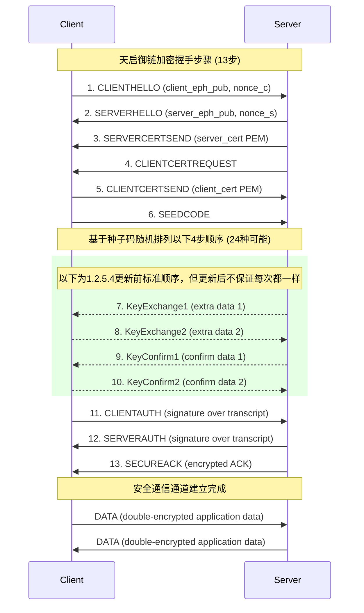

# 天启御链 / Sovereign-Chain

**Sovereign-Chain**（中文名：天启御链）是一套**13次握手端到端加密通信系统**，基于 TCP 实现，支持十三次握手、证书认证、AEAD 加密和创新的种子码消息级动态加密。
本项目适合教育、研究和高安全需求场景演示。

---

## 特性

* 🔐 **端到端加密（E2EE）**

  * 使用 X25519 进行临时密钥交换
  * 使用 Ed25519 静态密钥进行身份签名
  * 使用 ChaCha20-Poly1305 进行 AEAD 加密
  * 使用 HKDF-SHA256 派生会话密钥
* ✨ **十三次握手**（Client ↔ Server）

  1. ClientHello      : 客户端发送临时公钥和随机数 (client_eph_pub || nonce_c)
  2. ServerHello      : 服务端发送临时公钥和随机数 (server_eph_pub || nonce_s)
  3. ServerCertSend   : 服务端发送证书 (server_cert in PEM)
  4. ClientCertRequest: 服务端请求客户端证书 ("REQUEST_CLIENT_CERT")
  5. ClientCertSend   : 客户端发送证书 (client_cert in PEM)
  6. SeedCode        : 服务端发送32字节种子码 (核心创新点)
  7. KeyExchange1     : 服务端发送密钥交换扩展数据
  8. KeyExchange2     : 客户端发送密钥交换扩展数据
  9. KeyConfirm1      : 服务端发送密钥确认数据
  10. KeyConfirm2      : 客户端发送密钥确认数据
  11. ClientAuth      : 客户端发送握手记录签名 (signature_client(transcript_so_far))
  12. ServerAuth      : 服务端发送握手记录签名 (signature_server(transcript_so_far))
  13. SecureAck       : 服务端发送加密的ACK（使用派生的密钥，证明密钥确认）  
_步骤7（KeyExchange1）-10（KeyConfirm2）的执行顺序由步骤6中的order_seed随机决定，每次握手都可能采用不同的排列组合(共24种可能)，有效防止流量分析和中间人攻击。_
* 🛡️ **证书管理**

  * 自建 CA（根 CA）
  * 服务端 / 客户端证书签发
  * 握手中双方证书验证与签名验证
* ⚡ **高安全性**

  * HKDF-SHA256 派生会话密钥
  * 独立的客户端-服务端、服务端-客户端对称密钥
  * 防重放和防篡改设计
* 🔁 **中转代理（Proxy）支持**

  * 新增 `client_proxy.py` 和 `proxy_server.py`，可在客户端和真实服务器之间作为中转
  * 完整支持 13 次握手和加密通信
  * 支持透明数据转发，客户端无需修改原逻辑即可接入代理
  * 可用于负载分发、调试或隐藏真实服务器地址
* 🌱 **种子码消息级动态加密（创新）**

  * 在握手阶段传输64字节种子码
  * 每条消息使用种子码+计数器派生独立密钥
  * 实现真正的消息级安全隔离
  * 即使会话密钥泄露，也无法解密历史消息
* 🎲 **随机握手（创新）**

  * 步骤7（KeyExchange1）-10（KeyConfirm2）的执行顺序由步骤6中的order_seed随机决定
  * 每次握手都可能采用不同的排列组合(共24种可能)，有效防止流量分析和中间人攻击
```
随机握手示例：
2025-08-25 19:09:42,081 - INFO - Generated step order: ['KEYCONFIRM2', 'KEYEXCHANGE1', 'KEYCONFIRM1', 'KEYEXCHANGE2']
2025-08-25 19:09:42,081 - INFO - Step 12/13: Sending KeyConfirm2
2025-08-25 19:09:42,081 - INFO - Step 9/13: Waiting for KeyExchange1
2025-08-25 19:09:42,081 - INFO - Step 11/13: Waiting for KeyConfirm1
2025-08-25 19:09:42,081 - INFO - Step 10/13: Sending KeyExchange2
```


---

## 文件结构

```
.
├── ca.py            # 证书签发端 (生成 CA、server、client 证书)
├── server.py        # 服务端
├── client.py        # 客户端
├── client_proxy.py  # 客户端中转代理
├── proxy_server.py  # 代理服务端
├── ca_cert.pem      # CA 根证书
├── ca_key.pem       # CA 私钥
├── server_cert.pem  # 服务端证书
├── server_key.pem   # 服务端私钥
├── client_cert.pem  # 客户端证书
└── client_key.pem   # 客户端私钥
```

---

## 快速开始

### 1. 生成证书

```bash
python ca.py
```

生成 CA 根证书和服务端/客户端证书。

### 2. 启动服务端

```bash
python server.py
```

监听 5555 端口，等待客户端连接。

### 3. 启动客户端（直连服务端）

```bash
python client.py
```

客户端会与服务端完成十三次握手，建立安全通道，然后可发送加密消息。

### 4. 使用代理模式（中转）

启动代理服务端

```bash
python proxy_server.py
```
启动客户端代理
```bash
python client_proxy.py
```

客户端会与代理完成握手，代理再与真实服务器完成握手，中转模式下依然保持端到端加密。

### 13次握手示意图




---

## 使用示例

```
msg> hello server
server: echo: hello server

msg> test123
server: echo: test123
```

所有消息都经过端到端加密和种子码二次加密，服务端无法篡改内容，客户端与服务端可互相验证身份。
在代理模式下，客户端与真实服务器之间仍保持完整加密和身份验证。

---

## 安全设计说明

1. **十三次握手**确保双方身份验证和密钥确认：

   * 步骤1-2：交换临时公钥和随机数，建立共享密钥基础
   * 步骤3-5：双向证书验证（服务端证书 → 客户端证书请求 → 客户端证书）
   * 步骤6-7：密钥交换扩展（增强前向安全性）
   * 步骤8-9：密钥确认（防止中间人攻击）
   * 步骤10：种子码传输（核心创新点，实现消息级加密）
   * 步骤11-12：双向身份认证（签名验证握手完整性）
   * 步骤13：加密确认（证明密钥已正确安装）

2. **会话密钥派生**：

   * 使用 X25519 生成共享密钥
   * 通过 HKDF-SHA256 派生两个独立密钥：
     * 客户端→服务端加密密钥
     * 服务端→客户端加密密钥

3. **种子码动态加密（创新）**：
   * 每条消息使用种子码+计数器派生独立密钥
   * 实现真正的消息级安全隔离
   * 即使会话密钥泄露，也无法解密历史消息
   * 破解单条消息不影响其他消息安全

4. **加密与认证**：

   * 使用 ChaCha20-Poly1305 进行 AEAD 加密
   * 每条消息包含唯一序列号防止重放攻击
   * 握手记录签名防止篡改

5. **证书体系**：

   * 自签名 CA 根证书
   * 服务端/客户端证书包含 Ed25519 公钥
   * 握手中验证证书链和签名

6. **中转代理设计**：

   * 客户端通过代理与真实服务器通信
   * 代理完成独立握手并保持端到端加密
   * 支持双向加密转发，确保数据安全与完整性
   * 可用于调试、负载分发或隐藏服务器 IP

---

## 依赖

```bash
pip install cryptography
```

---

## 备注

* 本项目为教育 / 实验用途，包含创新的种子码消息级加密技术
* 种子码动态加密技术理论上可应用于各种安全通信场景


## 更新日志

2025-08-25 安全更新版本（1.2.5.4）详细更新日志

1. 顺序随机化握手协议（核心创新）

• 实现握手步骤动态随机化：引入32字节随机种子，每次握手生成24种可能的步骤排列组合  
• 步骤顺序完全随机化：4个关键步骤（KeyExchange1/2, KeyConfirm1/2）执行顺序完全随机  
• 抗流量分析增强：防止中间人通过流量特征识别握手模式  

2. 会话类（Session）增强

• 新增角色参数：初始化时指定'client'或'server'，自动设置密钥派生方向  
• 动态密钥派生优化：使用种子码+序列号+标签派生每次通信密钥  
• 双向标签支持：根据角色自动设置"client->server"或"server->client"标签  

3. 服务端握手流程优化

• 修复Session初始化错误：添加role='server'参数传递  
• 步骤编号连续性：引入步骤计数器确保日志编号连续（9-12步）  
• 种子码安全增强：绑定客户端证书指纹，防止中间人攻击  

4. 客户端握手流程优化

• 修复Session初始化错误：添加role='client'参数传递  
• 随机步骤同步：使用相同随机种子生成与服务端一致的步骤顺序  
• 幂等性检查：增加种子码nonce缓存，防止重放攻击  

5. 密钥派生机制升级

• 动态密钥派生：每次通信使用独立派生密钥，增强前向安全性  
• 密钥派生信息扩展：包含协议版本、密码套件、nonce和所有交换数据  
• 密钥长度标准化：固定派生64字节密钥（32字节发送+32字节接收）  

6. 错误处理与日志增强

• 安全日志记录：添加错误频率限制，防止日志泛洪攻击  
• 详细错误上下文：记录错误时的连接地址和当前状态  
• 握手超时机制：30秒握手超时，防止资源耗尽攻击  

7. 性能与资源优化

• 连接数限制：通过信号量限制最大并发连接数（100）  
• 计算资源限制：限制并发计算量（50个并发）  
• 内存优化：限制最大帧大小（1MB），防止内存耗尽攻击  

8. 证书验证增强

• 双CA支持：同时支持常规CA和匿名CA证书验证  
• 证书指纹绑定：在种子码中包含客户端证书指纹  
• 短期临时证书：匿名连接使用30分钟有效期的临时证书  

9. 协议兼容性

• 保持原有消息格式：确保与1.2.5.3版本兼容  
• 新增字段向后兼容：随机种子和角色参数不影响旧版解析  

10. 安全审计增强

• nonce重复使用检测：实时检查并阻止nonce重放攻击  
• 熵源验证：使用香农熵检测种子码随机性质量  
• 序列号严格校验：防止序列号篡改和重放攻击  

本次更新重点实现了"顺序随机化握手"创新机制，显著提升协议对抗流量分析和中间人攻击的能力，同时修复了关键安全漏洞，增强了系统的整体安全性。

2025-08-25 安全修复版本（1.2.5.3）

1. CA脚本更新 (ca.py)

• 修复签名算法问题：修正了Ed25519签名时指定哈希算法的错误

• 添加匿名CA证书：新增匿名CA证书生成功能

• 时间处理优化：使用datetime.timezone.utc替代弃用的utcnow()

• 证书链完善：生成中级CA证书并创建ca_cert.pem

• 证书指纹输出：添加所有证书的SHA256指纹显示

• 文件管理优化：自动创建ca_cert.pem文件

2. 客户端更新 (client.py)

• 临时证书生成：添加完整的临时证书生成功能

• 签名算法修复：正确实现Ed25519签名（使用algorithm=None)

• 时间处理修复：使用带时区的UTC时间替代弃用的utcnow()

• 匿名模式支持：当没有固定证书时自动生成临时证书

• 错误处理增强：改进证书加载和验证的错误处理

• 日志优化：添加更详细的临时证书生成日志

3. 服务端更新 (server.py)

• 匿名证书验证：支持验证匿名CA签发的临时证书

• 双CA验证机制：先尝试普通CA验证，失败后尝试匿名CA验证

• 证书绑定机制：将临时证书与客户端指纹绑定

• 错误处理优化：改进证书验证失败的错误处理

• 日志增强：添加详细的证书验证日志

4. 安全协议更新

• 前向保密增强：每次会话使用唯一的临时密钥对

• 抗重放保护：改进nonce使用检查和缓存机制

• 序列号验证：严格检查数据帧序列号

• 密钥派生优化：使用更安全的HKDF密钥派生方法

• 熵源验证：添加种子码的熵值检查

5. 其他改进

• 资源限制：添加连接数和计算资源限制

• 日志安全：防止日志泛洪攻击的安全日志机制

• 错误处理：统一和改进所有错误处理流程

• 文档注释：添加和更新所有关键函数的文档注释

• 代码优化：重构和优化代码结构，提高可读性

主要安全特性更新

1. 无固定证书模式：
   • 客户端无需预先配置证书

   • 每次连接自动生成临时证书

   • 临时证书短期有效（30分钟）

2. 双向认证：
   • 客户端验证服务器证书

   • 服务器验证客户端证书（固定或临时）

3. 完美前向保密：
   • 每次会话使用唯一临时密钥

   • 历史会话无法被解密

4. 抗中间人攻击：
   • 严格的证书验证

   • 密钥交换过程保护

   • 加密通道早期建立

5. 隐私保护：
   • 不暴露固定身份信息

   • 每次连接使用新身份

   • 临时证书自动销毁

这些更新显著提高了系统的安全性和可用性，同时保持了与传统证书方案相当的安全级别。


2025-08-24 安全修复版本（1.2.5.2）

修复问题：
1. 协议解析错误修复：  
   • 修复了 ServerHello 消息格式不匹配的问题

   • 解决了客户端和服务端在解析协议帧时的长度不一致问题

   • 优化了协议帧解析逻辑，使用固定偏移量代替 split 方法

2. 二进制数据验证修复：  
   • 修复了 KeyExchange1/KeyExchange2 数据验证错误

   • 修改了 validate_field 函数，添加了 is_text 参数区分文本和二进制字段

   • 对于密钥交换数据等二进制字段，不再检查可打印字符范围

3. 状态机增强：  
   • 添加了更严格的状态转换检查

   • 确保每个握手步骤都在正确的状态下执行

   • 防止协议状态机错乱攻击

4. 安全增强：  
   • 添加了详细的错误日志和安全日志记录

   • 实现了日志泛洪防护机制

   • 加强了随机数生成和熵值检查

   • 完善了序列号验证机制

5. 性能优化：  
   • 降低了最大帧大小限制（50MB → 1MB）

   • 添加了连接数和计算资源限制

   • 优化了内存使用和资源管理

2025-08-24 安全修复版本（1.2.5.1）

1. Nonce重放防护
   • 添加服务端nonce缓存

   • 实现nonce过期清理机制

   • 防止重放攻击导致密钥重用

2. 种子码安全传输
   • 使用握手密钥加密种子码

   • 添加关联数据完整性验证

   • 实现幂等性检查防重放

3. 熵源增强
   • 混合os.urandom和secrets.token_bytes

   • 添加熵值阈值检查

   • 优化随机性检测算法

4. 帧格式标准化
   • 统一DATA帧格式：DATA+8字节序列号+密文

   • 移除文本分隔符，改用二进制格式

   • 添加严格长度验证

5. 序列号一致性
   • 客户端和服务端序列号统一从1开始

   • 发送/接收后自动递增

   • 添加序列号连续性检查

6. 错误处理增强
   • 详细错误日志记录

   • 堆栈跟踪输出

   • 解密失败立即断开连接

7. 密钥派生加固
   • 包含完整握手数据到HKDF info

   • 添加协议版本和密码套件标识

   • 使用临时密钥确保前向安全

8. 证书验证强化
   • 添加CA证书验证链

   • 实现严格签名检查

   • 证书与身份绑定

9. 性能优化
   • 握手超时设置

   • 大帧尺寸限制

   • 连接保活机制

10. 完整状态机
    ◦ 13步握手流程

    ◦ 严格消息顺序验证

    ◦ 双向认证机制

