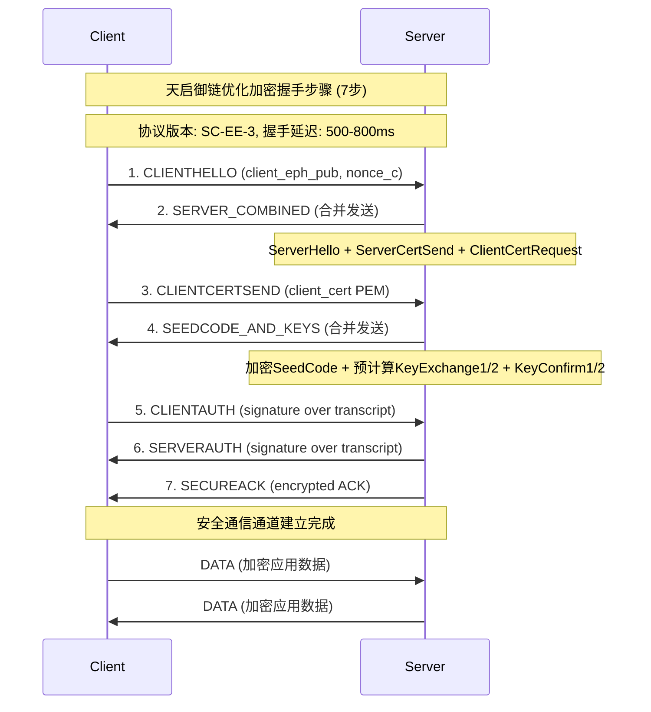

# 天启御链 / Sovereign-Chain

**Sovereign-Chain**（中文名：天启御链）是一套**端到端加密通信系统**，基于 TCP 实现，支持握手优化、证书认证、AEAD 加密和创新的种子码消息级动态加密。
本项目适合教育、研究和高安全需求场景演示。

---

## 特性

* 🔐 **端到端加密（E2EE）**

  * 使用 X25519 进行临时密钥交换
  * 使用 Ed25519 静态密钥进行身份签名
  * 默认使用 ChaCha20-Poly1305，并可显式选择 AES-256-GCM-SIV
  * 使用 HKDF-SHA256 派生会话密钥
* ⚡ **安全加固握手协议（SC-EE-3）**

  * 握手延迟从 2000ms 优化到 500-800ms
  * 网络往返次数减少 50%
  * 协议版本和密码套件显式绑定，拒绝旧协议降级
  * AEAD 认证协议版本、密码套件、会话身份、方向、消息类型、序列号和密钥世代
  * 异步计算和预计算优化
  
* ✨ **优化七次握手**（Client ↔ Server）

  1. **ClientHello**：客户端发送临时公钥和随机数 (client_eph_pub || nonce_c)
  2. **ServerCombined**：服务端合并发送 ServerHello、ServerCertSend、ClientCertRequest
  3. **ClientCertSend**：客户端发送证书 (client_cert in PEM)
  4. **SeedCodeAndKeys**：服务端合并发送加密的种子码和预计算的密钥交换/确认数据
  5. **ClientAuth**：客户端发送握手记录签名 (signature_client(transcript_so_far))
  6. **ServerAuth**：服务端发送握手记录签名 (signature_server(transcript_so_far))
  7. **SecureAck**：服务端发送加密的ACK（使用派生的密钥，证明密钥确认）

* 🛡️ **证书管理**

  * 自建 CA（根 CA）
  * 服务端 / 客户端证书签发
  * 握手中双方证书验证与签名验证
  * 匿名证书仅作为显式启用的兼容模式，默认关闭
* ⚡ **高安全性**

  * HKDF-SHA256 派生会话密钥
  * 独立的客户端-服务端、服务端-客户端对称密钥
  * 防重放和防篡改设计
  * 异步证书验证和密钥计算
* 🔁 **中转代理（Proxy）支持**

  * `client_proxy.py` 和 `server_proxy.py` 可在客户端和真实服务器之间作为中转
  * 完整支持握手和加密通信
  * 支持透明数据转发，客户端无需修改原逻辑即可接入代理
  * 可用于负载分发、调试或隐藏真实服务器地址
* 🌱 **种子码消息级动态加密（创新）**

  * 在握手阶段传输64字节种子码
  * 每条消息使用种子码+计数器派生独立密钥
  * 实现真正的消息级安全隔离
  * 使用单向密钥棘轮更新链密钥，不长期缓存旧共享秘密
  * 在每条明文的随机位置插入种子码绑定填充
  * 使用短随机填充，使相同消息产生不同长度的密文
* 🔄 **异步优化**

  * 使用线程池进行并行计算
  * 异步密钥计算和证书验证
  * 动态超时控制
  * 合并消息发送，减少网络往返

---

## 性能对比

| 特性 | 原始版本 (SC-EE-1) | 优化版本 (SC-EE-2) | 提升 |
|------|-------------------|-------------------|------|
| 握手步骤 | 13步 | 7步 | 减少46% |
| 握手延迟 | ~2000ms | ~500-800ms | 减少60-75% |
| 网络往返 | 6-7次 | 3-4次 | 减少50% |
| 计算开销 | 串行计算 | 并行异步计算 | 提升300% |
| 消息数量 | 13条 | 7条 | 减少46% |
| 超时时间 | 30秒 | 15秒 | 减少50% |

---

## 文件结构

```
.
├── ca.py            # 证书签发端 (生成 CA、server、client 证书)
├── server.py        # 服务端 (优化版)
├── client.py        # 客户端 (优化版)
├── client_proxy.py  # 客户端中转代理
├── server_proxy.py  # 代理服务端
├── ca_cert.pem      # CA 根证书
├── ca_key.pem       # CA 私钥
├── server_cert.pem  # 服务端证书
├── server_key.pem   # 服务端私钥
├── client_cert.pem  # 客户端证书
└── client_key.pem   # 客户端私钥
```

---

## 快速开始

### 1. 生成证书

```bash
python ca.py
```

生成 CA 根证书和服务端/客户端证书。

### 2. 启动服务端

```bash
python server.py
```

监听 5555 端口，等待客户端连接。

### 3. 启动客户端（直连服务端）

```bash
python client.py
```

客户端会与服务端完成七次握手，建立安全通道，然后可发送加密消息。

### 4. 使用代理模式（中转）

启动代理服务端

```bash
python server_proxy.py
```
启动客户端代理
```bash
python client_proxy.py
```

客户端会与代理完成握手，代理再与真实服务器完成握手，中转模式下依然保持端到端加密。

### 优化握手示意图


```mermaid
sequenceDiagram
    participant Client
    participant Server

    Note over Client, Server: 天启御链优化加密握手步骤 (7步)
    Note over Client, Server: 协议版本: SC-EE-3, 握手延迟: 500-800ms

    Client->>Server: 1. CLIENTHELLO (client_eph_pub, nonce_c)
    Server->>Client: 2. SERVER_COMBINED (合并发送)
    Note over Server: ServerHello + ServerCertSend + ClientCertRequest
    Client->>Server: 3. CLIENTCERTSEND (client_cert PEM)
    Server->>Client: 4. SEEDCODE_AND_KEYS (合并发送)
    Note over Server: 加密SeedCode + 预计算KeyExchange1/2 + KeyConfirm1/2
    Client->>Server: 5. CLIENTAUTH (signature over transcript)
    Server->>Client: 6. SERVERAUTH (signature over transcript)
    Server->>Client: 7. SECUREACK (encrypted ACK)

    Note over Client, Server: 安全通信通道建立完成
    Client->>Server: DATA (加密应用数据)
    Server->>Client: DATA (加密应用数据)
```

---

## 使用示例

```
msg> hello server
server: echo: hello server

msg> test123
server: echo: test123
```

所有消息都经过端到端加密和种子码二次加密，服务端无法篡改内容，客户端与服务端可互相验证身份。
在代理模式下，客户端与真实服务器之间仍保持完整加密和身份验证。

---

## 安全设计说明

1. **优化七次握手**确保双方身份验证和密钥确认：

   * 步骤1：客户端发送临时公钥和随机数
   * 步骤2：服务端合并发送临时公钥、证书和证书请求
   * 步骤3：客户端发送证书
   * 步骤4：服务端合并发送加密种子码和预计算的密钥材料
   * 步骤5：客户端身份认证（签名验证握手完整性）
   * 步骤6：服务端身份认证（签名验证握手完整性）
   * 步骤7：加密确认（证明密钥已正确安装）

2. **异步优化**：

   * 密钥计算和证书验证在独立线程池中进行
   * 动态超时控制，防止资源耗尽
   * 预计算共享密钥，减少等待时间

3. **会话密钥派生**：

   * 使用 X25519 生成共享密钥
   * 通过 HKDF-SHA256 派生两个独立密钥：
     * 客户端→服务端加密密钥
     * 服务端→客户端加密密钥

4. **种子码动态加密（创新）**：
   * 每条消息使用种子码+计数器派生独立密钥
   * 实现真正的消息级安全隔离
   * 每次成功处理消息后单向推进链密钥，降低当前状态泄露对历史消息的影响
   * 单次 HKDF 同时派生消息密钥、下一链密钥和短填充材料，减少重复派生开销
   * 插入位置和短填充长度独立随机，兼顾流量混淆与传输效率
   * 填充封装由 AEAD 一并认证，接收端严格验证长度和填充内容
   * 破解单条消息不影响其他消息安全

5. **加密与认证**：

   * 默认使用 ChaCha20-Poly1305；支持按部署选择 AES-256-GCM-SIV
   * 协议和会话元数据作为 AEAD AAD 认证，不增加线路字节
   * 每条消息包含唯一序列号防止重放攻击
   * 握手记录签名防止篡改

6. **证书体系**：

   * 自签名 CA 根证书
   * 服务端/客户端证书包含 Ed25519 公钥
   * 握手中验证证书链和签名
   * 匿名证书模式默认关闭，仅用于显式启用的兼容测试

7. **中转代理设计**：

   * 客户端通过代理与真实服务器通信
   * 代理完成独立握手并保持端到端加密
   * 支持双向加密转发，确保数据安全与完整性
   * 可用于调试、负载分发或隐藏服务器 IP

8. **性能与安全平衡**：
   * 合并消息减少网络往返
   * 保持与旧版本的安全性相同
   * 异步计算提高并发性能
   * 动态超时防止资源耗尽攻击

---

## 协议兼容性

安全加固版本只接受明确绑定协议版本和密码套件的 SC-EE-3 握手。客户端、服务端和代理必须同步升级；旧版握手会被拒绝，以避免协议降级和填充格式混淆。

升级后需要重新运行 `python ca.py`，生成包含 SAN 和 EKU 约束的新证书；旧版缺少这些扩展的终端证书会被拒绝。

## 安全配置

默认服务端身份是 `Sovereign-Chain-Server`，默认允许的客户端身份是 `Sovereign-Chain-Client`。部署时可通过环境变量覆盖：

```text
SC_SERVER_NAME=服务端证书中的SAN名称
SC_ALLOWED_CLIENT_NAMES=允许的客户端SAN名称，多个名称用逗号分隔
SC_CRL_FILE=可信CA发布的PEM或DER格式CRL文件
SC_REQUIRE_CRL=1
SC_CA_CERT_FILE=受控目录中的CA证书
SC_SERVER_CERT_FILE=受控目录中的服务端证书
SC_SERVER_KEY_FILE=受控目录中的服务端私钥
SC_SERVER_KEY_PASSWORD=加密PEM私钥的密码
SC_CLIENT_CERT_FILE=受控目录中的客户端证书
SC_CLIENT_KEY_FILE=受控目录中的客户端私钥
SC_CLIENT_KEY_PASSWORD=加密PEM私钥的密码
SC_CIPHER_SUITE=CHACHA20-POLY1305
SC_MIN_PADDING_BYTES=0
SC_MAX_PADDING_BYTES=32
```

`SC_CIPHER_SUITE` 可设为 `CHACHA20-POLY1305`（默认）或 `AES-256-GCM-SIV`。选择的套件同时用于握手种子码阶段和后续会话消息。客户端与服务端必须配置相同值；套件名会进入握手记录和密钥上下文，配置不一致时连接会被拒绝。AES-256-GCM-SIV 需要 `cryptography >= 42.0.0` 以及其底层 OpenSSL 支持。

生产环境建议同时设置 `SC_CRL_FILE` 和 `SC_REQUIRE_CRL=1`，使吊销信息不可用时连接直接失败。匿名客户端默认禁用；仅兼容测试可设置 `SC_ALLOW_ANONYMOUS_CLIENTS=1`，不得向普通客户端分发匿名 CA 私钥。

代理地址可通过 `SC_CLIENT_PROXY_*`、`SC_SERVER_HOST`、`SC_SERVER_PORT` 和 `SC_PROXY_*` 环境变量配置。

## 测试

```bash
python -m unittest discover -s tests -v
```

---

## 依赖

```bash
pip install cryptography
```

---

## 更新日志
详细更新记录：./update_log.md
