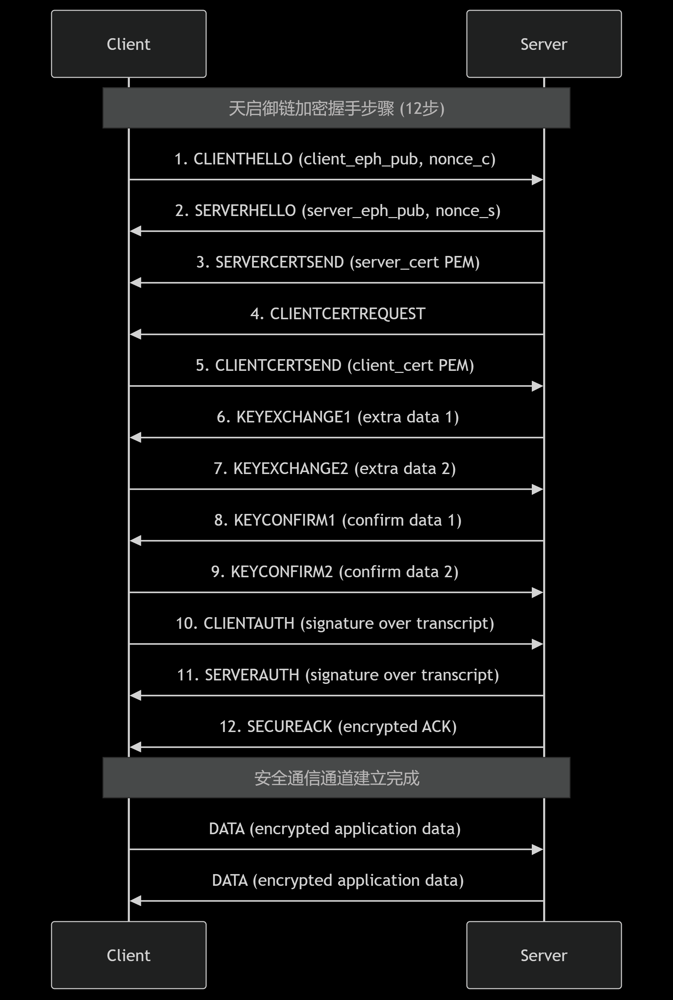

# 天启御链 / Sovereign-Chain

**Sovereign-Chain**（中文名：天启御链）是一套**12次握手端到端加密通信系统**，基于 TCP 实现，支持十二次握手、证书认证和 AEAD 加密。  
本项目适合教育、研究和高安全需求场景演示。

---

## 特性

- 🔐 **端到端加密（E2EE）**
  - 使用 X25519 进行临时密钥交换
  - 使用 Ed25519 静态密钥进行身份签名
  - 使用 ChaCha20-Poly1305 进行 AEAD 加密
  - 使用 HKDF-SHA256 派生会话密钥
- ✨ **十二次握手**
  1. ClientHello      : 客户端发送临时公钥和随机数 (client_eph_pub || nonce_c)
  2. ServerHello      : 服务端发送临时公钥和随机数 (server_eph_pub || nonce_s)
  3. ServerCertSend   : 服务端发送证书 (server_cert in PEM)
  4. ClientCertRequest: 服务端请求客户端证书 ("REQUEST_CLIENT_CERT")
  5. ClientCertSend   : 客户端发送证书 (client_cert in PEM)
  6. KeyExchange1     : 客户端发送密钥交换扩展数据
  7. KeyExchange2     : 服务端发送密钥交换扩展数据
  8. KeyConfirm1      : 客户端发送密钥确认数据
  9. KeyConfirm2      : 服务端发送密钥确认数据
  10. ClientAuth      : 客户端发送握手记录签名 (signature_client(transcript_so_far))
  11. ServerAuth      : 服务端发送握手记录签名 (signature_server(transcript_so_far))
  12. SecureAck       : 服务端发送加密的ACK（使用派生的密钥，证明密钥确认）
- 🛡️ **证书管理**
  - 自建 CA（根 CA）
  - 服务端 / 客户端证书签发
  - 握手中双方证书验证与签名验证
- ⚡ **高安全性**
  - HKDF-SHA256 派生会话密钥
  - 独立的客户端-服务端、服务端-客户端对称密钥
  - 防重放和防篡改设计

---

## 文件结构

.
├── ca.py            # 证书签发端 (生成 CA、server、client 证书)
├── server.py        # 服务端
├── client.py        # 客户端
├── ca_cert.pem      # CA 根证书
├── ca_key.pem       # CA 私钥
├── server_cert.pem  # 服务端证书
├── server_key.pem   # 服务端私钥
├── client_cert.pem  # 客户端证书
└── client_key.pem   # 客户端私钥

---

## 快速开始

### 1. 生成证书

bash
python ca.py

生成 CA 根证书和服务端/客户端证书。

### 2. 启动服务端

bash
python server.py

监听 5555 端口，等待客户端连接。

### 3. 启动客户端

bash
python client.py

客户端会与服务端完成十二次握手，建立安全通道，然后可发送加密消息。

### 12次握手示意图

---

## 使用示例

text
client> hello server
server: echo: hello server

client> test123
server: echo: test123

所有消息都经过端到端加密，服务端无法篡改内容，客户端与服务端可互相验证身份。

---

## 安全设计说明

1. **十二次握手**确保双方身份验证和密钥确认：
   - 步骤1-2：交换临时公钥和随机数，建立共享密钥基础
   - 步骤3-5：双向证书验证（服务端证书 → 客户端证书请求 → 客户端证书）
   - 步骤6-7：密钥交换扩展（增强前向安全性）
   - 步骤8-9：密钥确认（防止中间人攻击）
   - 步骤10-11：双向身份认证（签名验证握手完整性）
   - 步骤12：加密确认（证明密钥已正确安装）

2. **会话密钥派生**：
   - 使用 X25519 生成共享密钥
   - 通过 HKDF-SHA256 派生两个独立密钥：
     - 客户端→服务端加密密钥
     - 服务端→客户端加密密钥

3. **加密与认证**：
   - 使用 ChaCha20-Poly1305 进行 AEAD 加密
   - 每条消息包含唯一序列号防止重放攻击
   - 握手记录签名防止篡改

4. **证书体系**：
   - 自签名 CA 根证书
   - 服务端/客户端证书包含 Ed25519 公钥
   - 握手中验证证书链和签名

---

## 依赖

bash
pip install cryptography

---

## 备注

* 本项目为教育 / 实验用途，不建议直接替代 TLS 或成熟加密库的生产环境应用。
* 可进一步扩展：
  * 异步 asyncio 多客户端支持
  * 会话缓存与密钥轮换
  * WebSocket 或 UDP 变体

