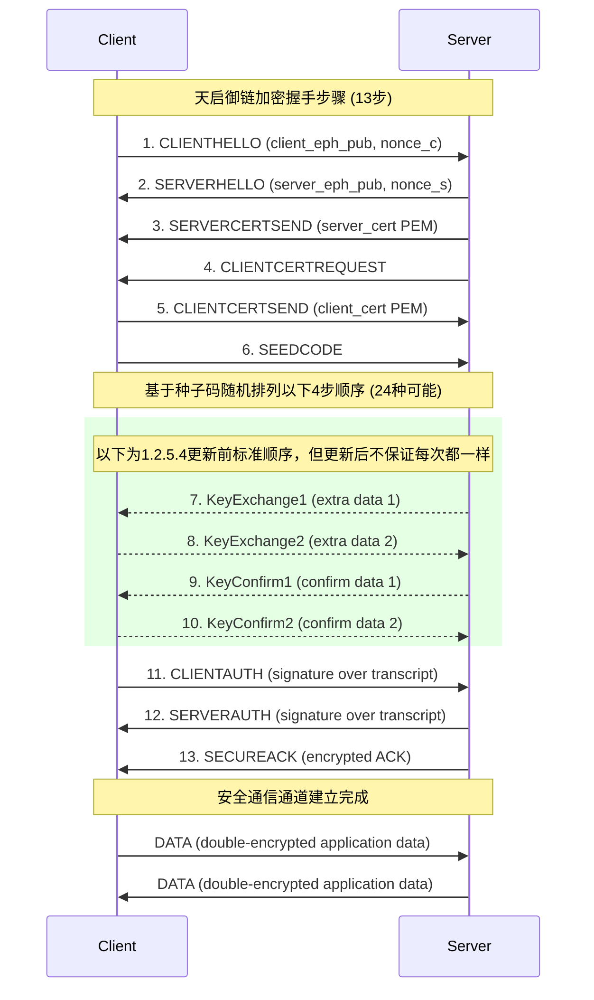

```mermaid
sequenceDiagram
    participant Client
    participant Server

    Note over Client, Server: 天启御链加密握手步骤 (13步)

    Client->>Server: 1. CLIENTHELLO (client_eph_pub, nonce_c)
    Server->>Client: 2. SERVERHELLO (server_eph_pub, nonce_s)
    Server->>Client: 3. SERVERCERTSEND (server_cert PEM)
    Server->>Client: 4. CLIENTCERTREQUEST
    Client->>Server: 5. CLIENTCERTSEND (client_cert PEM)
    Client->>Server: 6. SEEDCODE 
    Note over Client, Server: 基于种子码随机排列以下4步顺序 (24种可能)
    rect rgba(0, 255, 0, 0.1)
        Note over Client, Server: 以下为1.2.5.4更新前标准顺序，但更新后不保证每次都一样
        Server-->>Client: 7. KeyExchange1 (extra data 1)
        Client-->>Server: 8. KeyExchange2 (extra data 2)
        Server-->>Client: 9. KeyConfirm1 (confirm data 1)
        Client-->>Server: 10. KeyConfirm2 (confirm data 2)
    end
    Client->>Server: 11. CLIENTAUTH (signature over transcript)
    Server->>Client: 12. SERVERAUTH (signature over transcript)
    Server->>Client: 13. SECUREACK (encrypted ACK)

    Note over Client, Server: 安全通信通道建立完成
    Client->>Server: DATA (double-encrypted application data)
    Server->>Client: DATA (double-encrypted application data)
```